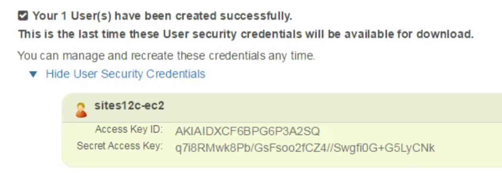
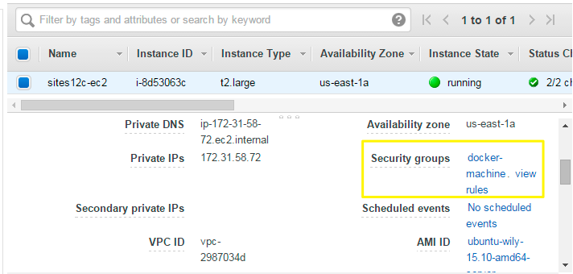
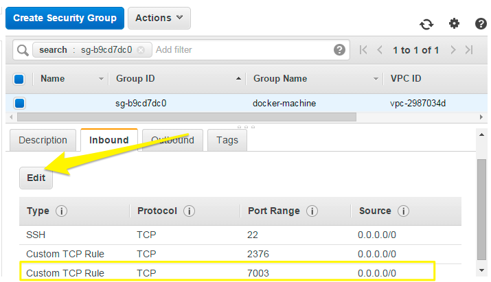

# Docker kit for Oracle WebCenter Sites v12c

This is a free kit we developed to install and manage WebCenter Sites 12c using docker and the Amazon cloud.

If you want, you can watch this video. Otherwise, read on.

WARNING: this written documentation is always more up to date than the video.

<iframe width="560" height="315" src="https://www.youtube.com/embed/k3gD0xjfEZQ" frameborder="0" allowfullscreen></iframe>

The kit can be used also with your own servers and in other clouds.

## Features

This kit is a collection of scripts to build docker images in different environments.

Supported environments are:

- Amazon Web Services cloud.
- A generic server running Linux.
- Virtualbox.

Actually, modifying the scripts, many more options are available, since docker supports a large number of environments.

Once built, the images can be saved on the Amazon S3 web storage service.

Scripts are provided to reuse the images without having to rebuild them.

# Using this kit

Let's start with an overview of how to use this kit. A video demonstration of the steps will follow.

First step is to download both the docker toolbox, for using Docker, and the kit sites12c-docker from GitHub.

Then, you can use it to build on Amazon EC2. The steps are the following.

 - create a proper virtual machine.
 - build an image with sites and the supporting software.
 - store the image in Amazon S3.

Finally, You can then run the image you created in a server in your local network.

The kit provides the script to run Docker in an existing Linux server

The kit include the scripts to download the image you created from Amazon S3.

Once downloaded, you can run your the images created in your own server.

## Download Docker Toolbox and the kit

To start work you need to

- Follow this link to download [Docker Toolbox](http://www.docker.com/docker-toolbox)
- Install also Git for Windows if using Windows
- Clone the `sites12c-docker` repository with:

```
git clone https://github.com/sciabarra/ssites12c-docker
```

# Step 0: creating a VM on Amazon Cloud

Let's start from the step "zero", preparing a virtual machine for building our images.

In this step we are going to launch an instance in the Amazon Cloud. We need to configure it a bit.


Log into Amazon, using a root account.

Create a new user and get his security key and secret.

Assign to him the permission to create virtual machines.

Select the zone and get the VPC ID.

When you create a new user you must get his security credentials. Most notably the key and the secret.

To see them,click on "show security credentials" to see the key and the secret.

Do not forget to save them for future use.



You  also need the VPC ID for creating the VM with the scripts.

To see the VPC ID, go to the Dashboard of the EC2 instances.

The VPC ID is shown on the right.


## Create the instance

Once we collected the informations you can execute the command shown below.

Note the machine name is an arbitrary name, while the others are the parameters we collected before.

```
sh 0-machine-amazon.sh machine-name amazon-key amazon-secret vpc-id
```

## Open the port 7003

After the instance is created you need to open port 7003.

Select the instance in the dashboard, then click on the link "docker-machine" to reach the security group.



Click on the edit button and add a Custom TCP Rule in the Inbound group. The rule must open port 7003 from any ip address.



## Alternative Step 0 scripts

The kit includes

- the `0-machine-ssh.sh` script to create a Docker VM in a generic server running a **supported** docker operating system. Warning: the machine should be powerful enough to to be able to install Linux. At least, 8G of memory and 20GB of disk space.

- the `0-machine-virtualbox.sh` script to create a Docker vm in VirtualBox (with enough memory to build sites). Warning: it will create a Virtual Machine with 8 Giga of Memory.

# Build Images

We are now ready to build the images.

The procedure is split in multiple steps to make it easier to check for errors.

We will:

Download software.

Install Weblogic.

Install WebCenter Sites.

Save the Image on Amazon S3.

## Step 1


The first script,  will automatically download the software from the Oracle website. Since software download requires an account, although a free one, you neeed to provide your credentials.

```
bash 1-download.sh [oracle-username] [oracle-password]
```

## Step 2

The second script will install Weblogic and Oracle in the images. You do not need to provide parameters for this.

```
bash 2-weblogic.sh
```

## Step 3

The third scripts install WebCenter Sites. Since sites requires an hostname, you may need to create an entry in your hosts file to point to the server where you are installing.

You have to provide also a password that will be used for all the default users in the system.

```
bash 3-sites.sh [public-hostname] [password]
```

## Step 4

The fourth step allows to save the images we created in the Amazon S3 web storage service. Data in S3 is stored in buckets.

You have to create a  bucket before executing the command, which requires a bucket name.


## Step 5

Once you created the images, you can reuse them to install a server with Sites. This step is comprised of a few substeps.

First, you need to set up a DNS alias to your server.

Second, you need to install manually Docker in a Server.

Then you can use a script to download Images from Amazon S3.

Finally you can run the images.

## Step 5.1 - Edit hosts

Your Sites image uses a specific name, so you need to edit the host file of your system to be sure the name you choose will point to your server.


## Step 5.2

Now, you need to install docker in your server. The details of the installation are different for each system.

Here is shown an example installation using Centos.

Consult the docker documentation for details about your Linux distribution.

```
yum install docker git
curl -L https://github.com/docker\
/compose/releases/download/1.5.2\
/docker-compose-`uname -s`-`uname -m`
\ >/usr/bin/docker-compose
chmod +x /usr/bin/docker-compose
git clone https://github.com/sciabarra/sites12c-docker
```

## Step 5.3

You are now ready to download the images, using the fifth script. You need to provide a number of parameters:

The hostname you assigned to sites.

The ip of your server.

The Amazon key and secret.

And finally the bucket name.

Once you collected all those informations, the script will do all the work needed to download a runnable Sites image in yours server.

```
bash 5-s3load.sh [sites-hostname] [public-ip] \
   [aws-key] [aws-secret]
	 [aws-bucketname]
```

## Step 5.4

Now you are ready to start. Just use the following command and you can use Sites!

```
docker-compose up -d
```
